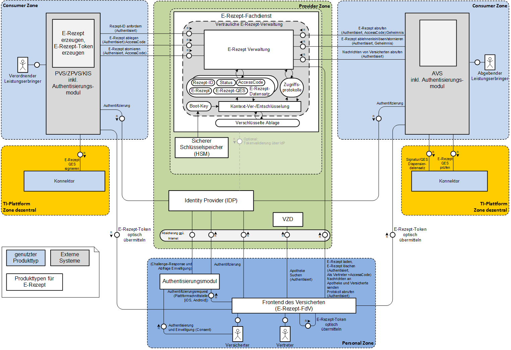

# Introduction

This project acts as reference implementation of main aspects of an e-prescription server designed by gematik.

Specifications of e-prescription application (E-Rezept, eRp) are published at
[Gematik Fachportal](https://fachportal.gematik.de/spezifikationen/online-produktivbetrieb/konzepte-und-spezifikationen/)

This implementation follows "Spezifikation E-Rezept Fachdienst" \[gemSpec\_FD\_eRP\] specification
available in specification bundle at location above. Additionally it follows further specifications
referenced by \[gemSpec\_FD\_eRP\].

This server offers a FHIR interface according to [HL7 FHIR](https://hl7.org/FHIR/) standard,
profiled to e-prescription needs. Profiling information are available at
[Simplifier](https://simplifier.net/erezept-workflow/).

In order to run the server in a trusted execution environment (VAU), it also implements a separate
protocol on top of http (eRp VAU protocol).

To get an overview about the server API we recommend reading [API description](https://github.com/gematik/api-erp).

# Limitations

There are limitations to this implementation as currently some parts are not implemented.
Following functionality is available:

-   REST server basics

-   eRp VAU protocol encryption and decryption

-   FHIR server basics:

    -   Capability Statement generation

    -   XML and JSON serialization and deserialization

    -   \_format parameter handling for Capability Statement

-   FHIR resources and operations

    -   Task resource

        -   read interaction

        -   $create operation

        -   $activate operation

-   access code generation

-   separate interfaces for eRp-App (FdV) and medical suppliers/pharmacies (LE)

There is no complete workflow implemented just now. It is intended as an very early release.

# License

Copyright (c) 2020 gematik GmbH

Licensed under the Apache License, Version 2.0 (the "License");
you may not use this file except in compliance with the License.
You may obtain a copy of the License at

<http://www.apache.org/licenses/LICENSE-2.0>

Unless required by applicable law or agreed to in writing, software
distributed under the License is distributed on an "AS IS" BASIS,
WITHOUT WARRANTIES OR CONDITIONS OF ANY KIND, either express or implied.
See the License for the specific language governing permissions and
limitations under the License.

# Overview

E-prescription server is a central part of e-prescription application and acts as a backend service
of e-prescription App as well as a central service of practitioner’s medical practice
administration systems and pharmacy’s administration systems.

To get an overview following picture depicts the system context and some
inner components of e-prescription server.

# Getting started

## Rust Toolchain

To build the ref-erx-fd-server you need the [Rust](https://www.rust-lang.org)
Toolchain. To setup the Toolchain follow [this instructions](https://www.rust-lang.org/learn/get-started).

## Dependencies

The ref-erx-fd-server has dependencies to external libraries listed below.

-   [OpenSSL](https://www.openssl.org) - OpenSSL is used to encrypt and decrypt requests
    send to the service. Please make sure you also have installed the development dependencies
    of OpenSSL.

## Build the Project

After you have successfully installed the Rust toolchain you can build the
project by invoking the following command.

    $ cargo build

## Run the Service

To run the service use the following command line. The service needs a
private key and X.509 certificate for the VAU encryption. These two parameters
are mandatory.

    $ cargo run -p ref-erx-fd-server -- --vau-key ./path/to/vau_key.pem --vau-cert ./path/to/vau_cert.pem

To get a full list of all supported parameters use

    $ cargo run -p ref-erx-fd-server -- --help

You can also execute the binary of the service directly without using cargo.
The binary can be found in the target directory

    $ ./ref-erx-fd-server --help
